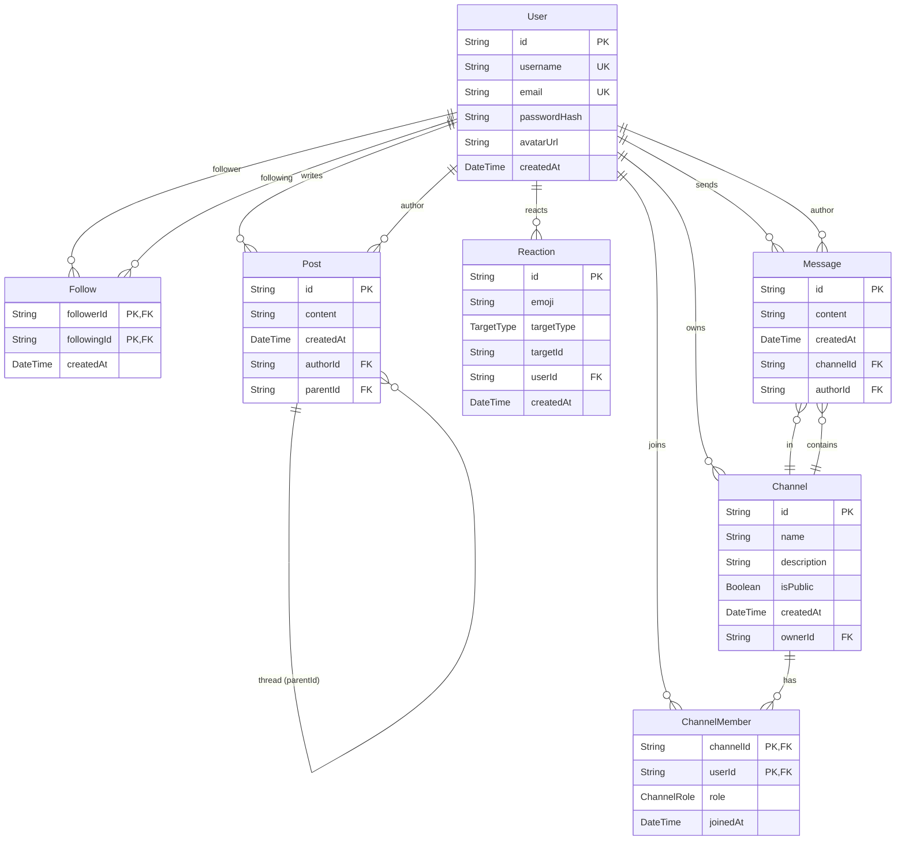

# ER-диаграмма SocialHub

## Связи

| Связь | Тип | Описание |
|-------|-----|----------|
| User → Post | 1:N | Пользователь пишет посты |
| User → Follow (follower) | 1:N | Пользователь подписывается |
| User → Follow (following) | 1:N | На пользователя подписываются |
| Post → Post (parentId) | 1:N self | Тред — ответы на пост |
| User → Reaction | 1:N | Пользователь ставит реакции |
| Reaction → Post/Message | полиморфная | targetType + targetId |
| User → Channel (owner) | 1:N | Пользователь владеет каналами |
| User ↔ Channel (через ChannelMember) | M:N | Участие с ролью |
| Channel → Message | 1:N | Канал содержит сообщения |
